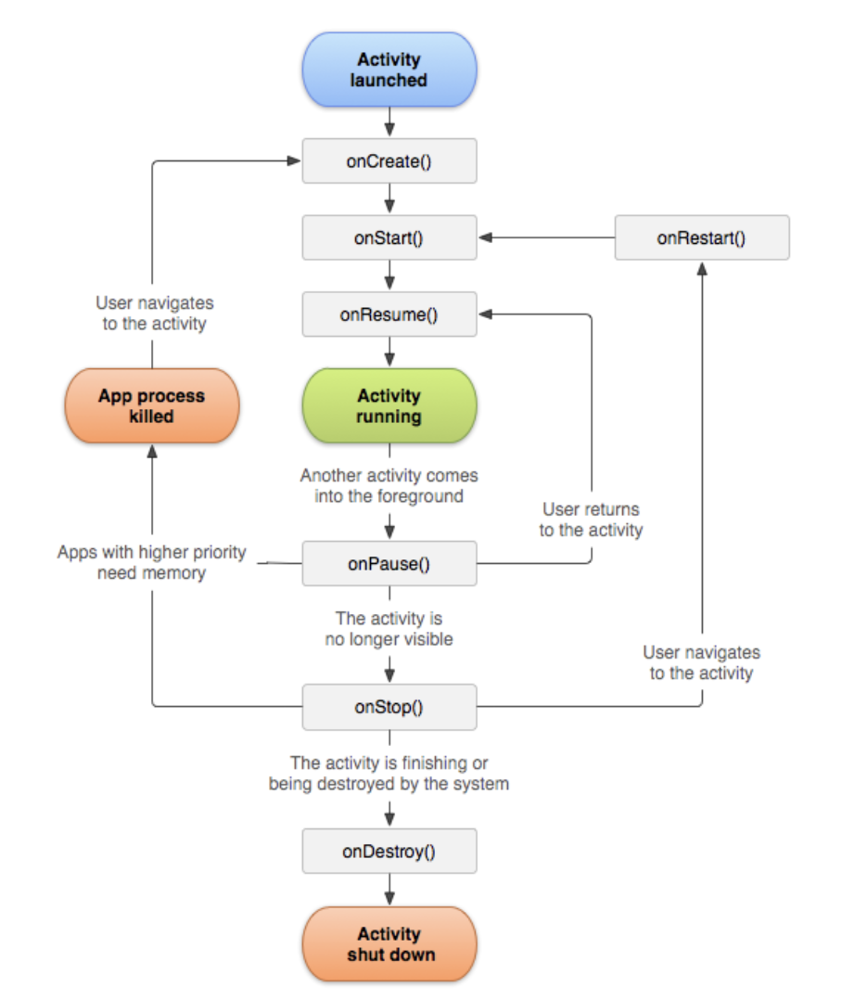

###### 안드로이드 앱을 처음 개발해보게 되었다. 공식문서를 보며 activity 수명 주기를 공부했고, 그 내용을 요약했다.

<!-- end -->


## Activity 수명 주기에 대한 이해

사용자가 Activity를 떠났다가 다시 돌아왔을 때 Activity가 어떤 식으로 동작할지에 대해 수명 주기 콜백 메서드 내에 선언할 수 있다. 수명 주기 콜백을 잘 구현하면 앱에서 다음과 같은 문제가 발생하지 않도록 예방하는 데 도움이 될 수 있다.

- 사용자가 앱을 사용하는 도중에 전화가 걸려오거나 다른 앱으로 전환할 때 발생하는 비정상적인 종료.
- 사용자가 앱을 활발하게 사용하지 않는 경우에도 지속적인 시스템 리소스의 소비.
- 사용자가 앱에서 나갔다가 나중에 돌아왔을 때 발생하는 사용자의 진행 상태 손실.
- 화면이 가로 방향과 세로 방향 간에 회전할 경우, 비정상 종료되거나 사용자의 진행 상태 손실.


## Activity 수명 주기 개념

Activity 수명 주기 상태 간의 전환하기 위해 Activity 클래스는 6가지 콜백으로 구성된 핵심 세트`onCreate()`, `onStart()`, `onResume()`, `onPause()`, `onStop()`, `onDestroy()`를 제공한다. Activity가 새로운 상태에 들어가면 시스템은 각 콜백을 호출한다. 아래의 그림은 이러한 패러다임을 나타낸다. (출처: [안드로이드 공식문서](https://developer.android.com/guide/components/activities/activity-lifecycle?hl=ko))




## 수명주기 콜백

### onCreate()

이 콜백은 시스템이 먼저 Activity를 생성할 때 실행되는 것으로, 필수적으로 구현해야 한다. Activity가 생성되면 Activity는 **생성됨** 상태가 된다. `onCreate()` 메서드에서 Activity의 전체 수명 주기 동안 한 번만 발생해야 하는 기본 애플리케이션 시작 로직을 수행한다. 예를 들어 `onCreate()`를 구현하면 데이터를 목록에 바인딩하고, Activity를 `ViewModel`과 연결하고, 일부 클래스 범위 변수를 인스턴스화할 수 있다. 이 메서드는 `savedInstanceState` 매개변수를 수신하는데, 이는 Activity의 이전 저장 상태가 포함된 `Bundle` 객체다. 이번에 처음 생성된 Activity인 경우 `Bundle` 객체의 값은 `null` 이다.

`onCreate()` 메서드에 대한 다음 예시는 사용자 인터페이스 선언(XML 레이아웃 파일에 정의됨), 멤버 변수 정의, 일부 UI 구성 등의 Activity에 대한 기본 설정을 보여준다. 이 예시에서 XML 레이아웃 파일은 파일의 리소스 ID인 `R.layout.main_activity`를 `setContentView()`에 전달하여 지정한다.

Activity는 **생성됨** 상태에 있지 않는다. `onCreate()` 메서드가 실행을 완료하면 **시작됨** 상태가 되고, 시스템이 연달아 `onStart()`와 `onResume()` 메서드를 호출한다. 

```kotlin
lateinit var textView: TextView

var gameState: String? = null

override fun onCreate(savedInstanceState: Bundle?) {
    // call the super class onCreate to complete the creation of activity like
    // the view hierarchy
    super.onCreate(savedInstanceState)

    // activity instance 복구
    gameState = savedInstanceState?.getString(GAME_STATE_KEY)

    // set the user interface layout for this activity
    // the layout file is defined in the project res/layout/main_activity.xml file
    setContentView(R.layout.main_activity)

  	// 초기 변수 설정
    textView = findViewById(R.id.text_view)
}


// onSaveInstanceState() 에 instance 를 저장한적이 있을 때 실행된다.
// 여기서 복구된 state를 onStart() 가 실행된 이후에 사용할 수 있다.
// savedInstanceState Bundle 은 onCreate() 에서 사용된 것과 같다.
override fun onRestoreInstanceState(savedInstanceState: Bundle?) {
    textView.text = savedInstanceState?.getString(TEXT_VIEW_KEY)
}

// activit 가 임의종료되었을 때, instance state 를 저장한다.
override fun onSaveInstanceState(outState: Bundle?) {
    outState?.run {
        putString(GAME_STATE_KEY, gameState)
        putString(TEXT_VIEW_KEY, textView.text.toString())
    }
    // call superclass to save any view hierarchy
    super.onSaveInstanceState(outState)
}
```


### onStart()

`onStart()` 가 호출되면 Activity가 사용자에게 보이게 되고, 앱은 Activity를 포그라운드에 보내 상호작용할 수 있도록 준비한다. 예를 들면, 이 메서드에서 앱이 UI를 관리하는 코드를 초기화한다.

Activity가 **시작됨** 상태로 전환하면 이 Activity의 수명 주기와 연결된 모든 수명 주기 인식 구성요소는 `ON_START` 이벤트를 수신한다.

`onStart()` 메서드는 매우 빠르게 완료되고, Activity는 **시작됨** 상태에 머무르지 않는다. 이 콜백이 완료되면 Activity가 **재개됨** 상태에 들어가고, 시스템이 `onResume()` 메서드를 호출한다.


### onResume()

Activity가 **재개됨** 상태에 들어가면 포그라운드에 표시되고 시스템이 `onResume()` 콜백을 호출한다. 이 상태에 들어갔을 때 앱이 사용자와 상호작용한다. 어떤 이벤트가 발생하여 앱에서 포커스가 떠날 때까지 앱이 이 상태에 머무른다. 예를 들어 전화가 오거나, 사용자가 다른 Activity로 이동하거나, 기기 화면이 꺼지는 등 이벤트가 이에 해당한다.

Activity가 **재개됨** 상태로 전환되면 이 Activity의 수명 주기와 연결된 모든 수명 주기 인식 구성요소는 `ON_RESUME` 이벤트를 수신한다. 이 상태에서 수명 주기 구성요소가 포그라운드에서 사용자에게 보이는 동안 실행해야 하는 모든 기능을 활성화할 수 있다(예: 카메라 미리보기 시작).

방해되는 이벤트가 발생하면 Activity는 **일시정지됨** 상태에 들어가고, 시스템이 `onPause()` 콜백을 호출한다.

Activity가 **일시정지됨** 상태에서 **재개됨** 상태로 돌아오면 시스템이 `onResume()` 메서드를 다시 한번 호출한다. 따라서 `onResume()`을 구현하여 `onPause()` 중에 해제하는 구성요소를 초기화하고, Activity가 **재개됨** 상태로 전환될 때마다 필요한 다른 초기화 작업도 수행해야 합니다.

구성요소가 `ON_RESUME` 이벤트를 수신할 때 카메라에 액세스하는 수명 주기 인식 구성요소의 예시는 다음과 같다.

```kotlin
class CameraComponent : LifecycleObserver {

    ...

    @OnLifecycleEvent(Lifecycle.Event.ON_RESUME)
    fun initializeCamera() {
        if (camera == null) {
            getCamera()
        }
    }

    ...
}
```

위의 코드는 `LifecycleObserver` 가 `ON_RESUME` 이벤트를 수신하면 카메라를 초기화한다. 만약 사용자가 멀티 윈도우 모드에 있을 때 Activity를 포함하지 않는 다른 창을 탭하면 Activity가 **일시정지됨** 상태로 전환된다. 앱이 **재개됨** 상태(포그라운드에 표시되고 활성화된 상태)인 경우에만 카메라를 활성화하고 싶다면 위의 `ON_RESUME` 이벤트가 실행된 다음에 카메라를 초기화해야 한다. Activity가 `일시정지됨` 상태이지만 표시되어 있는 동안(예: 멀티 윈도우 모드) 카메라를 활성 상태로 유지하고 싶다면 `ON_START` 이벤트가 실행된 이후에 카메라를 초기화해야 한다. 그러나 Activity가 **일시정지됨** 상태일 때 카메라를 활성화하면 멀티 윈도우 모드에서 **재개됨** 상태에 있는 다른 앱이 카메라에 액세스하지 못할 수도 있다. Activity가 **일시정지됨** 상태일 때 카메라를 활성 상태로 유지해야 하는 경우도 있지만, 이 경우 전반적인 사용자 환경이 실질적으로 저하될 수 있다. 

어떤 빌드업 이벤트에서 초기화 작업을 실행하든 그에 상응하는 수명 주기 이벤트를 사용하여 리소스를 해제해야 한다. `ON_START` 이벤트 이후에 무언가를 초기화하는 경우, `ON_STOP` 이벤트 이후에 이를 해제하거나 종료해야 한다. `ON_RESUME` 이벤트 이후에 초기화하는 경우, `ON_PAUSE` 이벤트 이후에 해제해야 한다.


### onPause()

시스템은 사용자가 Activity를 떠나는 것을 첫 번째 신호로 이 메서드를 호출한다(하지만 해당 Activity가 항상 소멸되는 것은 아니다). Activity가 포그라운드에 있지 않게 되었다는 것을 나타낸다(다만 사용자가 멀티 윈도우 모드에 있을 경우에는 여전히 보일 수도 있다). `onPause()` 메서드를 사용하여 Activity가 **일시정지됨** 상태일 때 계속 실행(또는 적절히 계속 실행)되어서는 안 되지만 잠시 후 다시 시작할 작업을 일시정지하거나 조정한다. Activity가 이 상태에 들어가는 이유는 여러 가지가 있다. 예를 들면 다음과 같다.

- 일부 이벤트가 앱 실행을 방해하는 경우.
- Android 7.0(API 레벨 24) 이상에서는 멀티 윈도우가 지원되는데, 이 때 다른 앱을 포커스하는 경우.
- 새로운 반투명 Activity(예: 대화상자)가 열리는 경우. Activity가 여전히 부분적으로 보이지만 포커스 상태가 아닌 경우에는 **일시정지됨** 상태로 유지된다.

Activity가 **일시정지됨** 상태로 전환하면 이 Activity의 수명 주기와 연결된 모든 수명 주기 인식 구성요소는 `ON_PAUSE` 이벤트를 수신한다. 여기에서 수명 주기 구성요소는 구성요소가 포그라운드에 있지 않을 때 실행할 필요가 없는 기능을 모두 정지할 수 있다(예: 카메라 미리보기 정지).

또한 `onPause()` 메서드를 사용하여 시스템 리소스, 센서 핸들(예: GPS) 또는 Activity가 일시정지 중이고 사용자가 필요로 하지 않을 때, 배터리 수명에 영향을 미칠 수 있는 모든 리소스를 해제할 수도 있다. 그러나 앞서 `onResume()` 섹션에서 언급했듯이 일시정지된 Activity는 멀티 윈도우 모드에서 여전히 완전히 보이는 상태일 수 있다. 그러므로 멀티 윈도우 모드를 더욱 잘 지원하기 위해 UI 관련 리소스와 작업을 완전히 해제하거나 조정할 때는 `onPause()` 대신 `onStop()` 을 사용하는 것이 좋다.

다음과 같이 `LifecycleObserver`가 `ON_PAUSE` 이벤트에 응답하는 예는 위의 `ON_RESUME` 이벤트에 대응하며, `ON_RESUME` 이벤트가 수신된 후 초기화된 카메라를 해제한다.

```kotlin
class CameraComponent : LifecycleObserver {

    ...

    @OnLifecycleEvent(Lifecycle.Event.ON_PAUSE)
    fun releaseCamera() {
        camera?.release()
        camera = null
    }

    ...
}
```

`onPause()`는 아주 잠깐 실행되므로 저장 작업을 수행하기에는 시간이 부족할 수 있다. 그러므로 `onPause()`를 사용하여 애플리케이션 또는 사용자 데이터를 저장하거나, 네트워크 호출을 하거나, 데이터베이스 트랜잭션을 실행해서는 안 된다. 부하가 큰 종료 작업은 `onStop()` 상태일 때 실행해야 한다.

`onPause()` 메서드의 실행이 완료되더라도 Activity가 **일시정지됨** 상태로 남아 있을 수 있다. Activity는 다시 시작되거나 사용자에게 완전히 보이지 않게 될 때까지 이 상태에 머무른다.


### onStop()

Activity가 사용자에게 더 이상 표시되지 않으면 **중단됨** 상태에 들어가고, 시스템은 `onStop()` 콜백을 호출한다. 이는 예를 들어 새로 시작된 Activity가 화면 전체를 차지할 경우에 적용된다. 시스템은 Activity의 실행이 완료되어 종료될 시점에 `onStop()`을 호출할 수도 있다.

Activity가 **중단됨** 상태로 전환하면 이 Activity의 수명 주기와 연결된 모든 수명 주기 인식 구성요소는 `ON_STOP` 이벤트를 수신한다. 여기에서 수명 주기 구성요소는 구성요소가 화면에 보이지 않을 때 실행할 필요가 없는 기능을 모두 정지할 수 있다.

`onStop()` 메서드에서는 앱이 사용자에게 보이지 않는 동안 앱은 필요하지 않은 리소스를 해제하거나 조정해야 한다. 예를 들어 앱은 애니메이션을 일시정지하거나, 세밀한 위치 업데이트에서 대략적인 위치 업데이트로 전환할 수 있다. `onPause()` 대신 `onStop()`을 사용하면 사용자가 멀티 윈도우 모드에서 Activity를 보고 있더라도 UI 관련 작업이 계속 진행된다.

또한 `onStop()`을 사용하여 CPU를 비교적 많이 소모하는 종료 작업을 실행해야 한다. 예를 들어 정보를 데이터베이스에 저장할 적절한 시기를 찾지 못했다면 `onStop()` 상태일 때 저장할 수 있다. 다음 예시는 초안 내용을 영구 저장소에 저장하는 `onStop()`을 구현한 것이다.

```kotlin
override fun onStop() {
    // call the superclass method first
    super.onStop()

    // save the note's current draft, because the activity is stopping
    // and we want to be sure the current note progress isn't lost.
    val values = ContentValues().apply {
        put(NotePad.Notes.COLUMN_NAME_NOTE, getCurrentNoteText())
        put(NotePad.Notes.COLUMN_NAME_TITLE, getCurrentNoteTitle())
    }

    // do this update in background on an AsyncQueryHandler or equivalent
    asyncQueryHandler.startUpdate(
            token,     // int token to correlate calls
            null,      // cookie, not used here
            uri,       // The URI for the note to update.
            values,    // The map of column names and new values to apply to them.
            null,      // No SELECT criteria are used.
            null       // No WHERE columns are used.
    )
}
```

위의 코드 샘플은 SQLite를 직접 사용한다.

Activity가 **중단됨** 상태에 들어가면 `Activity` 객체는 메모리 안에 머무르게 된다. 이 객체가 모든 상태 및 멤버 정보를 관리하지만 창 관리자와 연결되어 있지는 않다. Activity가 다시 시작되면 이 정보를 다시 호출한다. 최상위 상태가 재개됨 상태인 콜백 메서드 중에 생성된 구성요소는 다시 초기화할 필요가 없다. 또한 시스템은 레이아웃에 있는 각 `View` 객체의 현재 상태도 기록한다. 따라서 사용자가 `EditText` 위젯에 텍스트를 입력하면 해당 내용이 저장되기 때문에 이를 저장 및 복원할 필요가 없다.

> **참고:** Activity가 중단되면 시스템은 해당 Activity가 포함된 프로세스를 소멸시킬 수 있다(시스템이 메모리를 복구해야 하는 경우). Activity가 중단된 동안 시스템이 프로세스를 소멸시키더라도 `Bundle`(키-값 쌍의 blob)에 있는 `View` 객체(예: `EditText` 위젯의 텍스트) 상태가 그대로 유지되고, 사용자가 이 Activity로 돌아오면 이를 복원한다. 

Activity는 **정지됨** 상태에서 다시 시작되어 사용자와 상호작용하거나, 실행을 종료하고 사라진다. Activity가 다시 시작되면 시스템은 `onRestart()`를 호출한다. `Activity`가 실행을 종료하면 시스템은 `onDestroy()`를 호출한다.


### onDestroy()

`onDestroy()`는 Activity가 소멸되기 전에 호출된다. 시스템은 다음 중 하나에 해당할 때 이 콜백을 호출한다.

1. (사용자가 Activity를 완전히 닫거나 Activity에서 `finish()`가 호출되어) Activity가 종료되는 경우
2. 구성 변경(예: 기기 회전 또는 멀티 윈도우 모드)으로 인해 시스템이 일시적으로 Activity를 소멸시키는 경우

Activity가 **소멸됨** 상태로 전환하면 이 Activity의 수명 주기와 연결된 모든 수명 주기 인식 구성요소는 `ON_DESTROY` 이벤트를 수신한다. 여기서 수명 주기 구성요소는 Activity가 소멸되기 전에 필요한 것을 정리할 수 있다.

Activity에 소멸되는 이유를 결정하는 로직을 입력하는 대신 `ViewModel` 객체를 사용하여 Activity의 관련 뷰 데이터를 포함해야 한다. Activity가 구성 변경으로 인해 다시 생성될 경우 ViewModel은 그대로 보존되어, 다음 Activity 인스턴스에 전달되므로 추가 작업이 필요없다. Activity가 다시 생성되지 않을 경우 ViewModel은 `onCleared()` 메서드를 호출하여 Activity가 소멸되기 전에 모든 데이터를 정리해야 한다.

이와 같은 두 가지 시나리오는 `isFinishing()` 메서드로 구분할 수 있다.

Activity가 종료되는 경우 `onDestroy()`는 Activity가 수신하는 마지막 수명 주기 콜백이 된다. 구성 변경으로 인해 `onDestroy()`가 호출되는 경우 시스템이 즉시 새 Activity 인스턴스를 생성한 다음, 새로운 구성에서 그 새로운 인스턴스에 대해 `onCreate()`를 호출한다.

`onDestroy()` 콜백은 이전의 콜백에서 아직 해제되지 않은 모든 리소스(예:`onStop()`)를 해제해야 한다.


## Activity 상태 및 메모리에서 제거

| 종료될 가능성 | 프로세스 상태                                    | Activity 상태        |
| :------------ | :----------------------------------------------- | :------------------- |
| 최소          | 포그라운드(포커스가 있거나 포커스를 가져올 예정) | 생성됨 시작됨 재개됨 |
| 높음          | 백그라운드(포커스 상실)                          | 일시정지됨           |
| 최대          | 백그라운드(보이지 않음)<br />비어 있음           | 정지됨<br />소멸됨   |


## 임시 UI 상태 저장 및 복원

시스템 제약으로 인해 Activity가 소멸되면 `ViewModel`, `onSaveInstanceState()` 및/또는 로컬 저장소를 결합하여 사용자의 임시 UI 상태를 보존해야 한다.


### Instance State

정상적인 앱 동작으로 인해 Activity가 소멸되는 시나리오는 몇 가지가 있다. 

- 사용자가 Back 버튼을 누른 경우.
- Activity가 `finish()` 메서드를 호출하여 자체적인 소멸 신호를 보내는 경우.

이 시나리오에서 사용자의 기대가 시스템의 동작과 일치하므로 추가적인 작업이 필요없다.

그러나 시스템이 시스템 제약(예: 구성 변경 또는 메모리 부족)으로 인해 Activity를 소멸시킬 경우, 실제 Activity 인스턴스는 사라지더라도 시스템에 존재했다는 정보는 남아 있다. 사용자가 Activity로 다시 돌아가려고 시도하면, 시스템은 소멸 당시 Activity의 상태를 설명하는 저장된 데이터 세트를 사용하여 해당 Activity의 새로운 인스턴스를 생성한다.

시스템이 이전 상태를 복원하기 위해 사용하는 저장된 데이터를 `인스턴스 상태`라고 하며, 이는`Bundle` 객체에 저장된 키-값 쌍의 컬렉션이다. 기본적으로 시스템은 `Bundle` 인스턴스 상태를 사용하여 Activity 레이아웃의 각 `View` 객체에 대한 정보를 저장한다(예: `EditText` 위젯에 입력된 텍스트 값). 

따라서 Activity 인스턴스가 소멸되고 재생성된 경우, 레이아웃의 상태는 별도의 코드 요청 없이 이전 상태로 복원된다. 하지만 Activity에서 사용자 진행 상태를 추적하는 멤버 변수처럼 Activity에 복원하고자 하는 상태 정보가 더 많이 있는 경우도 있다.

> **참고:** Android 시스템이 Activity에서 뷰의 상태를 복원하기 위해서는 `android:id` 특성으로 제공되는 고유 ID가 각 뷰마다 있어야 한다.

`Bundle` 객체는 메인 스레드에서 직렬화되어야 하고 시스템 프로세스 메모리를 사용하므로 소량의 데이터를 보존하는 데만 적합하다. 극소량 이상의 데이터를 보존하려면 영구 로컬 저장소, `onSaveInstanceState()` 메서드, `ViewModel` 클래스로 데이터를 보존하는 복합적인 방법을 사용해야 한다.


### onSaveInstanceState()를 사용한 UI 상태 저장

Activity가 정지되기 시작하면 인스턴스 상태 번들에 상태 정보를 저장할 수 있도록 시스템이 `onSaveInstanceState()` 메서드를 호출한다. 이 메서드의 기본 구현은 `EditText` 위젯 내 텍스트 또는 `ListView` 위젯의 스크롤 위치와 같은 Activity의 뷰 계층 구조에 대한 임시 정보를 저장한다.

Activity의 추가적인 인스턴스 상태 정보를 저장하려면 `onSaveInstanceState()`를 재정의하고, Activity가 예상치 못하게 소멸될 경우 저장되는 `Bundle` 객체에 키-값 쌍을 추가해야 한다. `onSaveInstanceState()`를 재정의할 경우 기본 구현에서 뷰 계층 구조의 상태를 저장하고자 한다면 상위 클래스 구현을 호출해야 한다. 예를 들면 다음과 같다.

```kotlin
override fun onSaveInstanceState(outState: Bundle?) {
    // Save the user's current game state
    outState?.run {
        putInt(STATE_SCORE, currentScore)
        putInt(STATE_LEVEL, currentLevel)
    }

    // Always call the superclass so it can save the view hierarchy state
    super.onSaveInstanceState(outState)
}

companion object {
    val STATE_SCORE = "playerScore"
    val STATE_LEVEL = "playerLevel"
}
```

> **참고:** 사용자가 Activity를 명시적으로 닫는 경우 또는 `finish()`가 호출된 경우에는 `onSaveInstanceState()`가 호출되지 않는다.

영구 데이터(예: 사용자 기본 설정 또는 데이터베이스 데이터)를 저장하려면 Activity가 포그라운드에 있을 때 적절한 기회를 잡아야 한다. 그럴 기회가 없으면 `onStop()` 메서드가 호출되었을 때 해당 데이터를 저장해야 합니다.


### 저장된 인스턴스 상태를 사용하여 Activity UI 상태 복원

Activity가 이전에 소멸된 후 재생성되면, 시스템이 Activity에 전달하는 `Bundle`로부터 저장된 인스턴스 상태를 복구할 수 있다. `onCreate()` 및 `onRestoreInstanceState()` 콜백 메서드 둘 다 인스턴스 상태 정보를 포함하는 동일한 `Bundle`을 수신한다.

`onCreate()` 메서드는 시스템이 Activity의 새 인스턴스를 생성하든, 이전 인스턴스를 재생성하든 상관없이 호출되므로, 읽기를 시도하기 전에 `Bundle` 상태가 `null`인지 반드시 확인해야 한다. `null`일 경우, 시스템은 이전에 소멸된 Activity의 인스턴스를 복원하지 않고 새 인스턴스를 생성한다.

예를 들어 다음 코드 스니펫은 `onCreate()`에서 일부 상태 데이터를 복원하는 방법을 보여준다.

```kotlin
override fun onRestoreInstanceState(savedInstanceState: Bundle?) {
    // Always call the superclass so it can restore the view hierarchy
    super.onRestoreInstanceState(savedInstanceState)

    // Restore state members from saved instance
    savedInstanceState?.run {
        currentScore = getInt(STATE_SCORE)
        currentLevel = getInt(STATE_LEVEL)
    }
}
```


## Activity 간 이동

### 다른 Activity에서 Activity 시작하기

Activity가 새로 시작하려는 Activity에서 결과를 받기를 원하는지 여부에 따라 `startActivity()`나 `startActivityForResult()` 메서드 중 하나를 사용하여 새 Activity를 시작한다. 두 가지 경우 모두 `Intent` 객체를 전달한다.

`Intent` 객체는 시작하고자 하는 Activity를 정확히 나타내거나, 수행하고자 하는 작업의 유형을 설명한다(시스템이 적절한 Activity를 선택하며, 이는 다른 애플리케이션에서 가져온 것일 수도 있다). `Intent` 객체는 시작된 Activity에서 사용할 소량의 데이터를 포함할 수 있다.


#### startActivity()

본인의 애플리케이션 내에서 작업하는 경우에는 알려진 Activity를 시작하기만 하면 되는 경우가 많다.

```kotlin
val intent = Intent(this, SignInActivity::class.java)
startActivity(intent)
```

또한 애플리케이션에서 다른 몇 가지 작업을 수행하고자 할 수도 있다. 예를 들어 이메일 보내기, SMS 보내기 또는 상태 업데이트 등의 작업을 Activity의 데이터를 사용하여 수행할 수 있다. 이 경우, 본인의 애플리케이션에 그러한 동작을 수행할 자체 Activity가 없을 수도 있다. 따라서 기기에 있는 다른 애플리케이션이 제공하는 Activity를 대신 활용하여 동작을 수행하게 할 수 있다.

```kotlin
val intent = Intent(Intent.ACTION_SEND).apply {
    putExtra(Intent.EXTRA_EMAIL, recipientArray)
}
startActivity(intent)
```

인텐트에 추가된 `EXTRA_EMAIL`은 이메일이 전송되어야 할 이메일 주소의 문자열 배열이다. 이메일 애플리케이션이 이 인텐트에 응답하면, 애플리케이션은 엑스트라에서 제공된 문자열 배열을 읽은 다음 이를 이메일 작성 양식의 "수신" 필드에 배치한다. 이 상황에서 이메일 애플리케이션의 Activity가 시작되고 사용자가 작업을 끝내면 여러분의 Activity가 재개된다.


#### startActivityForResult()

Activity가 종료될 때 결과를 반환받고자 할 수도 있다. 예를 들어 사용자가 연락처 목록에서 어떤 사람을 선택할 수 있도록 하는 Activity를 시작할 수 있다. 이 Activity가 종료되면 선택한 사람을 반환한다. 이렇게 하려면 `startActivityForResult(Intent, int)` 메서드를 호출해야 한다. 이 메서드에서는 정수 매개변수가 호출을 식별한다. 이 식별자는 동일한 Activity에서 `startActivityForResult(Intent, int)`에 대한 여러 개의 호출을 명확히 구분하는 역할을 한다. 이는 글로벌 식별자가 아니며, 다른 앱이나 Activity와 충돌할 위험이 없다. 결과는 `onActivityResult(int, int, Intent)` 메서드를 통해 반환된다.

하위 Activity가 존재할 경우 `setResult(int)`를 호출하여 상위 Activity로 데이터를 반환할 수 있다. 하위 Activity는 언제나 결과 코드를 제공한다. 이는 표준 결과인 `RESULT_CANCELED`, `RESULT_OK`가 되거나 `RESULT_FIRST_USER`로 시작하는 임의의 맞춤 값이 될 수도 있다. 또한 하위 Activity는 원하는 모든 추가 데이터가 포함된 `Intent` 객체를 반환할 수도 있다. 상위 Activity는 원래 제공했던 정수 식별자와 함께 `onActivityResult(int, int, Intent)` 메서드를 사용하여 정보를 수신한다.

어떤 이유(예: 비정상 종료)로든 하위 Activity가 실행되지 않으면 상위 Activity는 `RESULT_CANCELED` 코드가 포함된 결과를 수신한다.

```kotlin
class MyActivity : Activity() {
    // ...

    override fun onKeyDown(keyCode: Int, event: KeyEvent?): Boolean {
        if (keyCode == KeyEvent.KEYCODE_DPAD_CENTER) {
            // When the user center presses, let them pick a contact.
            startActivityForResult(
                    Intent(Intent.ACTION_PICK,Uri.parse("content://contacts")),
                    PICK_CONTACT_REQUEST)
            return true
        }
        return false
    }

    override fun onActivityResult(requestCode: Int, resultCode: Int, intent: Intent?) {
        when (requestCode) {
            PICK_CONTACT_REQUEST ->
                if (resultCode == RESULT_OK) {
                    startActivity(Intent(Intent.ACTION_VIEW, intent?.data))
                }
        }
    }

    companion object {
        internal val PICK_CONTACT_REQUEST = 0
    }
}
```


#### Activity 조정

한 Activity가 다른 Activity를 시작하면, 둘 모두 수명 주기가 전환된다. 다른 Activity가 생성되는 동안 첫 번째 Activity는 작동을 중단하고 일시정지됨 또는 정지됨 상태로 들어간다. 이와 같은 Activity가 디스크 또는 다른 곳에 저장된 데이터를 공유하는 경우, 첫 번째 Activity는 두 번째 Activity가 생성되기 전에 완전히 중단되지 않는다는 점을 이해하는 것이 중요하다. 그렇다기보다는 두 번째 Activity의 시작 과정이 첫 번째 Activity 중단 과정과 겹쳐 일어난다.

수명 주기 콜백은 분명히 정의된 순서가 있으며, 특히 두 개의 Activity가 같은 프로세스(앱) 안에 있으면서 하나가 다른 하나를 시작하는 경우 순서가 더욱 확실하다. Activity A가 Activity B를 시작할 때 발생하는 작업 순서는 아래와 같다.

1. Activity A의 `onPause()` 메서드가 실행된다.
2. Activity B의 `onCreate()`, `onStart()` 및 `onResume()` 메서드가 순차적으로 실행된다. (이제 사용자 포커스는 Activity B에 있다.)
3. 그런 다음, Activity A가 더 이상 화면에 표시되지 않는 경우 이 Activity의 `onStop()` 메서드가 실행된다.

